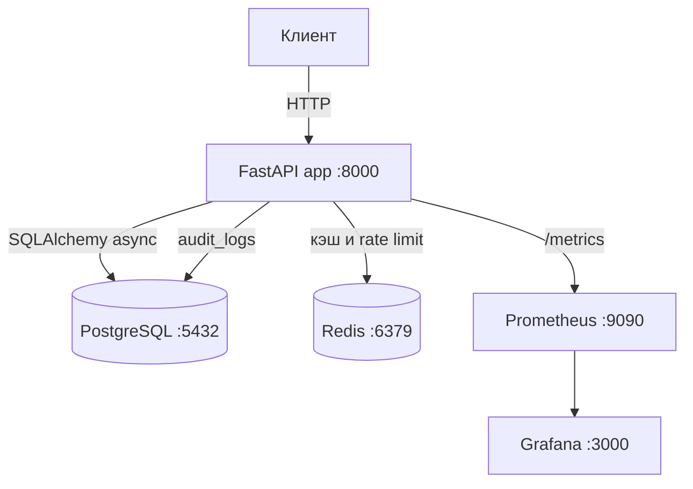

# AEGIS Alpha

Инфраструктурное ядро для поиска повторяющихся паттернов в рыночном шуме. Сейчас в репозитории работает production-каркас бэкенда: API, база, кэш, аудит и мониторинг. Сбор новостей, котировок и статистическая модель ещё не подключены к этому сервису.

Репозиторий: [github.com/dimitry8st-prog/AEGIS-ALPHA](https://github.com/dimitry8st-prog/AEGIS-ALPHA)

## Идея

Классический анализ ищет устойчивую закономерность и строит из неё прогноз. AEGIS Alpha исходит из другого допущения: на коротком горизонте рынок хаотичен, а полезный сигнал прячется в повторениях шума — сообщениях Telegram, отчётах и котировках.

Рабочая гипотеза:

1. Собрать сырой поток: каналы, файлы, рыночные ряды.
2. Не «объяснять» новость, а считать, какие сочетания повторяются рядом с движением цены.
3. Отбирать точки входа статистически, ближе к статистическому арбитражу, чем к теханализу или к дорогому LLM.

Пока гипотеза не проверена на данных. Код сбора есть как черновик в `src/`, но запускаемый сервис — пакет `app/`.

## Что уже работает

Sprint 0, инфраструктура:

- FastAPI-сервис на порту 8000 (`app/main.py`)
- PostgreSQL 15, схема пользователей, записей и журнала аудита
- Redis 7: rate limit и cache-aside
- JWT-аутентификация, роли `user` и `admin`
- Prometheus и готовый дашборд Grafana
- Docker Compose, данные лежат в именованных volumes

## Чего ещё нет

- Рабочий сборщик Telegram и Yahoo Finance внутри запущенного API
- Аналитическое ядро: FinBERT, корреляции, бэктест
- Проверка гипотезы на истории (целевой ориентир обсуждался как accuracy выше 55%)
- Пакет `src/` не является точкой входа контейнера и в текущем виде не запускается: нет `src/config/settings.py`, нет зависимостей Telethon, yfinance, pandas, pdfplumber в `requirements.txt`, в `src/main.py` не хватает импортов `os`, `datetime`, `timedelta`

## Архитектура запущенного сервиса



Порядок middleware: метрики, затем rate limit, затем аудит. Приложение не хранит сессию в процессе: кэш и лимиты живут в Redis, поэтому несколько инстансов могут стоять за балансировщиком. У каждого инстанса свой `INSTANCE_ID`, он пишется в аудит.

## Стек

| Слой | Технология |
|---|---|
| API | Python 3.11, FastAPI 0.104, Uvicorn, Pydantic 2 |
| База | PostgreSQL 15, SQLAlchemy 2 async, asyncpg |
| Кэш | Redis 7 |
| Доступ | JWT (`python-jose`), пароли bcrypt (`passlib`) |
| Наблюдаемость | Prometheus, Grafana, structlog |
| Сборка | Docker, Docker Compose |

Alembic указан в зависимостях. Каталога миграций в репозитории нет: таблицы создаёт `init.sql` при первом старте Postgres и `Base.metadata.create_all` при старте приложения.

## Структура репозитория

```
.
├── app/                         # рабочий бэкенд, его запускает контейнер
│   ├── main.py                  # FastAPI, /health, /results
│   ├── api/v1/                  # auth, users, items, audit
│   ├── core/                    # config, db, redis, jwt, rate limit, audit, metrics
│   ├── models/                  # User, Item, AuditLog
│   └── schemas/
├── src/                         # черновик сборщиков, не подключён к Docker
│   ├── main.py
│   ├── data_pipeline/           # telegram, market data, file processor
│   └── compliance/              # audit logger и политики хранения
├── docker/
│   ├── prometheus/prometheus.yml
│   └── grafana/                 # datasource, provisioning, дашборд API
├── docker-compose.yml
├── Dockerfile
├── init.sql
├── requirements.txt
├── .env.example
├── .gitlab-ci.yml
└── shema.txt                    # ранняя схема каталогов, расходится с деревом
```

## Быстрый старт

Нужны Docker и Docker Compose.

```bash
cp .env.example .env
# в .env замените POSTGRES_PASSWORD, JWT_SECRET_KEY и GRAFANA_PASSWORD
docker compose up -d --build
```

Проверка:

```bash
curl http://localhost:8000/health
```

Ответ содержит `"status": "healthy"` и `instance_id`. Интерактивная схема API: [http://localhost:8000/docs](http://localhost:8000/docs).

Контейнер `app` монтирует каталог проекта в `/app`. Команда процесса — `uvicorn app.main:app`. Образ собран на `python:3.11-slim` и работает от пользователя `appuser`.

Остановка:

```bash
docker compose down
```

Чтобы пересоздать базу с нуля (удалит локальные данные):

```bash
docker compose down -v
docker compose up -d --build
```

### Локальный запуск без полного Compose

Postgres и Redis всё равно должны быть доступны.

```bash
python -m venv .venv
.venv\Scripts\activate
pip install -r requirements.txt
```

В `.env` для процесса на хосте укажите `DATABASE_URL` и `REDIS_URL` на `localhost`, затем:

```bash
uvicorn app.main:app --reload --host 0.0.0.0 --port 8000
```

`DATABASE_URL` и `JWT_SECRET_KEY` обязательны: без них `Settings()` не создаётся.

## Сервисы

| Сервис | Адрес | Назначение |
|---|---|---|
| API | http://localhost:8000 | бэкенд |
| OpenAPI | http://localhost:8000/docs | документация запросов |
| Результаты | http://localhost:8000/results | HTML-таблица записей `items` |
| Метрики | http://localhost:8000/metrics | Prometheus |
| Prometheus | http://localhost:9090 | сбор метрик каждые 15 с с `app:8000` |
| Grafana | http://localhost:3000 | дашборд API, логин из `.env` |

## Конфигурация

Все настройки читает `app/core/config.py` из окружения и файла `.env`.

| Переменная | Смысл | По умолчанию |
|---|---|---|
| `DATABASE_URL` | строка SQLAlchemy к Postgres | обязательна |
| `REDIS_URL` | Redis | `redis://localhost:6379/0` |
| `JWT_SECRET_KEY` | подпись токена | обязательна |
| `JWT_ALGORITHM` | алгоритм JWT | `HS256` |
| `JWT_EXPIRATION_HOURS` | жизнь токена, часы | `24` |
| `RATE_LIMIT_REQUESTS` | запросов в окне | `100` |
| `RATE_LIMIT_WINDOW_SECONDS` | длина окна, секунды | `60` |
| `AUDIT_LOG_RETENTION_DAYS` | срок хранения аудита | `90` |
| `LOG_LEVEL` | уровень логов | `INFO` |
| `INSTANCE_ID` | имя инстанса в аудите | `instance-1` |
| `POSTGRES_USER` / `POSTGRES_PASSWORD` / `POSTGRES_DB` | учётка контейнера Postgres | см. `.env.example` |

В `docker-compose.yml` пароль Postgres и секрет JWT имеют запасные значения только для локального подъёма. Для любого общего стенда задайте свои значения в `.env`. Файл `.env` в git не входит.

`DATABASE_URL` внутри Compose должен совпадать с `POSTGRES_USER`, `POSTGRES_PASSWORD` и `POSTGRES_DB`. Имя базы по умолчанию — `aegis`. Если сменить `POSTGRES_DB` на уже инициализированном volume, Postgres не переименует кластер: нужен `docker compose down -v`.

## API

Базовый префикс бизнес-методов: `/api/v1`.

### Аутентификация

| Метод | Путь | Кто |
|---|---|---|
| `POST` | `/api/v1/auth/register` | любой |
| `POST` | `/api/v1/auth/login` | любой, в ответе JWT |
| `GET` | `/api/v1/auth/me` | текущий пользователь |

Регистрация принимает JSON `{"email", "password"}`. Роль по умолчанию — `user`.

### Пользователи

Только `admin`.

| Метод | Путь |
|---|---|
| `GET` | `/api/v1/users` |
| `GET` | `/api/v1/users/{user_id}` |
| `PUT` | `/api/v1/users/{user_id}` |
| `DELETE` | `/api/v1/users/{user_id}` |

### Items

Любой аутентифицированный пользователь. `Item` — пример сущности, не рыночный сигнал.

| Метод | Путь |
|---|---|
| `GET` | `/api/v1/items` |
| `GET` | `/api/v1/items/{item_id}` |
| `POST` | `/api/v1/items` |
| `PUT` | `/api/v1/items/{item_id}` |
| `DELETE` | `/api/v1/items/{item_id}` |

`GET` идёт через cache-aside в Redis. Запись, изменение и удаление сбрасывают кэш. Если Redis недоступен, чтение уходит в базу.

### Аудит

Только `admin`.

| Метод | Путь | Смысл |
|---|---|---|
| `GET` | `/api/v1/audit` | журнал с фильтрами |
| `DELETE` | `/api/v1/audit/cleanup` | удалить записи старше срока хранения |

### Служебные

| Метод | Путь | Смысл |
|---|---|---|
| `GET` | `/health` | живость процесса |
| `GET` | `/metrics` | метрики Prometheus |
| `GET` | `/results` | HTML-список items |

### Пример

```bash
curl -X POST http://localhost:8000/api/v1/auth/register \
  -H "Content-Type: application/json" \
  -d "{\"email\": \"user@example.com\", \"password\": \"password123\"}"

curl -X POST http://localhost:8000/api/v1/auth/login \
  -H "Content-Type: application/json" \
  -d "{\"email\": \"user@example.com\", \"password\": \"password123\"}"
```

Дальше заголовок `Authorization: Bearer <token>`.

```bash
curl -X POST http://localhost:8000/api/v1/items \
  -H "Authorization: Bearer TOKEN" \
  -H "Content-Type: application/json" \
  -d "{\"title\": \"Test Item\", \"description\": \"Description\"}"
```

Ошибки приходят единым JSON с полем `error.code` (`USER_ALREADY_EXISTS`, `RATE_LIMIT_EXCEEDED` и другие). При превышении лимита есть `retry_after`. Лимит считается скользящим окном в Redis sorted set, отдельно по IP и по ключу API.

## Данные

`init.sql` создаёт:

- `users` — email, хэш пароля, роль `user` или `admin`, флаг активности
- `items` — заголовок, описание, автор
- `audit_logs` — действие (`CREATE`, `UPDATE`, `DELETE`), тип и id ресурса, JSON до и после, IP, User-Agent, `instance_id`

На `users` и `items` висит триггер `updated_at`. Индексы стоят на email, роли, авторе, времени и полях аудита.

Журнал пишет middleware на изменения данных. В запись попадают пользователь из JWT, момент, снимок до и после и идентификатор инстанса. Это задел под compliance, а не торговый отчёт.

Страница `/results` читает `items` и рисует таблицу: id, заголовок, начало описания, время создания. Если таблица пустая, страница об этом говорит.

## Черновик сборщиков в `src/`

Эти модули описывают следующий шаг, но Docker их не запускает.

| Модуль | Замысел |
|---|---|
| `src/data_pipeline/telegram_collector.py` | Telethon, новые сообщения каналов, ссылки, упоминания, хэштеги, тикеры в `telegram_messages` и `telegram_ticker_mentions` |
| `src/data_pipeline/market_data.py` | Yahoo Finance по списку тикеров вроде AAPL, MSFT, NVDA; кэш в Redis; индикаторы в `market_data` |
| `src/data_pipeline/file_processor.py` | PDF, Excel, CSV и картинки из каталога входящих файлов в `processed_files` |
| `src/compliance/audit_logger.py` | отдельный журнал действий сборщиков |
| `src/compliance/data_policy.py` | сроки хранения: персональные данные, финансы, рынок, новости, аналитика |
| `src/main.py` | второй FastAPI, пул asyncpg, фоновые задачи раз в 5 минут и ночная очистка в 03:00 |

Схема таблиц для этого контура зашита в `src/main.py` и не совпадает с `init.sql` (другие типы id, другие колонки `users` и `audit_logs`). Подключать оба контура к одной базе без отдельной миграции нельзя.

Чтобы черновик стал сервисом, нужно как минимум: пакет настроек, зависимости в `requirements.txt`, починка импортов и решение, какой процесс является единственной точкой входа.

## Наблюдаемость

Prometheus снимает `http_requests_total`, `http_request_duration_seconds`, `http_errors_total`, `active_connections`. Дашборд лежит в `docker/grafana/dashboards/api_metrics.json` и подключается провижинингом. Логи приложения структурированные, с `trace_id`.

## Масштабирование

Сервис stateless. Для двух копий задайте разные `INSTANCE_ID` и разные внешние порты, Redis и Postgres оставьте общими, перед ними поставьте балансировщик. Сессии в памяти процесса нет.

## Безопасность

- Пароли хранятся как bcrypt-хэш.
- Доступ к пользователям и аудиту закрыт ролью `admin`.
- Rate limit режет всплеск запросов.
- CORS сейчас открыт на `*` — перед внешним доступом список источников нужно сузить в `app/main.py`.
- Секреты не коммитятся: `.env` в `.gitignore`.
- Образ не запускает процесс от root.

Это не лицензия на выдачу инвестиционных рекомендаций. Сигналы, если они появятся, нужно отдельно сверять с требованиями юрисдикции.

## CI

`.gitlab-ci.yml` описывает три стадии: pytest с Postgres и Redis, сборка Docker-образа в GitLab Registry, выкладка по SSH на `main`. Сейчас стадия тестов не пройдёт: каталога `tests/` нет, покрытие считается по `src`, а рабочие тесты должны смотреть на `app`.

## Дорожная карта

| Этап | Результат |
|---|---|
| Сбор данных | Telegram и котировки пишутся в PostgreSQL |
| Первый разбор | Jupyter или скрипт: есть ли повторяемые связки шума и цены |
| Проверка гипотезы | бэктест, понятный порог качества |
| Сигналы | только после проверки, например алерт в Telegram |
| Масштаб | отдельные сервисы сбора и модели, если гипотеза жива |

Ближайший полезный шаг — начать копить данные, а не расширять API.

## Известные ограничения

- Два несовместимых контура данных: `app/` + `init.sql` и черновик `src/`.
- `shema.txt` описывает каталоги `src/config`, `tests` и `.env.example` в старом виде. Конфига и тестов на диске нет; `.env.example` добавлен под рабочий сервис `app/`.
- Healthcheck в `Dockerfile` вызывает библиотеку `requests`, её нет в `requirements.txt`, поэтому проверка внутри образа может быть красной при живом API. Снаружи смотрите `GET /health`.
- В CI нет реальных тестов.
- Аналитической модели в репозитории нет.

## Лицензия

Внутренний проект. Отдельный файл лицензии не задан.
