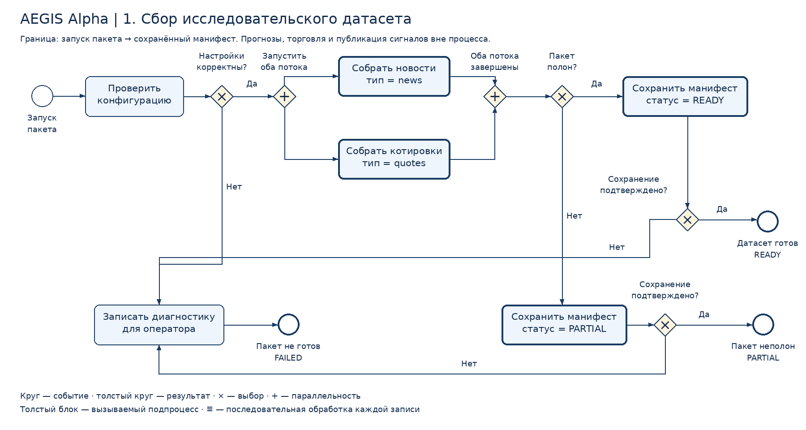

# AEGIS Alpha — BPMN сбора исследовательского датасета

Автор: Степанов Д.А. · 03.10.2026

**Выбрано одно задание: проектирование BPMN на собственном проекте.** Дополнительное задание с обработкой ошибок и циклом включено в ту же модель.

Пакет содержит описание, четыре связанных диаграммы, PNG для доски, SVG и редактируемый BPMN 2.0 XML. Это проект процесса, а не работающий сборщик или импортируемый n8n workflow. XML помечен `isExecutable=false`.

## Основание и проверенный статус

Проверен репозиторий [dimitry8st-prog/AEGIS-ALPHA](https://github.com/dimitry8st-prog/AEGIS-ALPHA), исходный commit `524ba7098b36958842f00ec02573c87b78af7563`. Docker запускает `app.main:app`; сборщики Telegram и котировок уже существуют как черновики в `src/`, но не подключены к рабочему сервису. Поэтому фраза из аналитической записки об отсутствии сборщиков уточняется: заготовки есть, подтверждённого работающего контура сбора нет.

Проверка кода и инфраструктуры описана в [отчёте](project-review-2026-10-03.md). Контейнеры и внешние источники в этой сессии не запускались. Схема ниже описывает целевой процесс; её добавление не означает внедрение автоматизации.

## Готовое описание для домашнего задания

Я выбрал процесс подготовки исследовательского датасета AEGIS Alpha. Вручную аналитик собирает финансовые новости и котировки, проверяет обязательные поля, приводит время к одному часовому поясу, удаляет технические дубли и сохраняет результаты. Цель автоматизации — получать воспроизводимый набор данных с источниками, временем получения и отчётом о полноте.

Процесс начинается при запуске пакета вручную или по согласованному расписанию. Сначала проверяются настройки источников, доступы, список инструментов и временное окно. Если настройки некорректны, процесс заканчивается диагностикой для оператора. Если настройки корректны, параллельно выполняются два подпроцесса: сбор новостей и сбор котировок. Каждый подпроцесс возвращает итог даже при отказе источника.

Каждая полученная запись проверяется и нормализуется. Некорректные записи помещаются в карантин с причиной. Корректные записи сохраняются атомарно по уникальному ключу; повторная доставка не создаёт новую строку. При временной ошибке чтения или записи выполняются ограниченные повторные попытки. Если результат записи неизвестен, сначала проверяется фактическое состояние по ключу. Неустранимая ошибка возвращается в итог потока.

После завершения обоих потоков система проверяет полноту пакета. При достаточном покрытии сохраняется манифест READY; при пропусках или недоступности источников — PARTIAL с перечнем проблем. Успешный финал наступает только после подтверждённого сохранения манифеста. Если это невозможно, фиксируется диагностика и результат FAILED. Оператор исправляет причину и запускает новый пакет с теми же ключами, чтобы продолжить сбор без технических дублей.

**Вход:** конфигурация источников, разрешённые доступы, список инструментов, окно времени, уже сохранённые записи и контрольные позиции источников. **Выход:** проверенные записи, карантин, манифест полноты либо диагностика ошибки. **В границах:** сбор, проверка, нормализация, сохранение и отчёт о качестве. **Вне границ:** поиск прибыльных закономерностей, прогнозы, покупка/продажа активов и публикация торговых сигналов.

Дополнительное задание реализовано подпроцессом `Process_IO`: не более трёх попыток, ожидание 30 секунд между попытками и выход при постоянной ошибке или истечении общего срока пакета. Все эти значения — предлагаемые учебные правила, не действующие настройки сервера.

## Схемы

1. [Основной процесс](bpmn/Process_Aegis.png).
2. [Сбор одного потока](bpmn/Process_Collect.png).
3. [Проверка и сохранение записи](bpmn/Process_Record.png).
4. [Обработка ошибок и повторные попытки](bpmn/Process_IO.png).
5. [Редактируемая модель BPMN 2.0](bpmn/aegis-alpha-data-collection.bpmn).

**Как сдавать:** загрузить основной PNG в Miro или Яндекс.Доски, разместить рядом PNG обработки ошибок и готовое описание, сделать скриншот самой доски и прикрепить его к заданию. Основная и дополнительные диаграммы — один процесс, раскрытый через вызываемые подпроцессы. Доска в этом пакете не создана; картинки не называются скриншотами Miro/Досок. Для редактирования отдельных BPMN элементов использовать `.bpmn` в BPMN-редакторе; PNG/SVG на доске являются изображениями.

## Паспорт процесса

| Поле | Предлагаемое правило |
|---|---|
| Владелец и ответственный за исключения | Степанов Д.А.; технический оператор — владелец MVP |
| Запуск | В MVP вручную; расписание выбрать после определения частоты котировок, часового пояса и лимитов источников |
| Единица работы | Один пакет: `window_start`, `window_end`, набор источников/инструментов, `config_version` |
| Идентификаторы | `batch_key = hash(window + config_version)`; отдельный `run_id` для каждой попытки запуска |
| Общий срок | 15 минут от запуска; не более 3 попыток одной операции, 30 секунд ожидания между ними |
| Таймаут операции | 20 секунд для одного чтения/записи; проверка неизвестного исхода также ограничена 20 секундами |
| Предел данных | 1000 записей на поток/пакет в учебном MVP; превышение → PARTIAL, оставшийся диапазон переносится в новый пакет |
| Контроль времени | Проверять deadline перед каждым вызовом, записью и повтором; по истечении завершать поток с кодом DEADLINE_EXCEEDED |
| READY | Источники прочитаны до согласованной позиции, обязательные котировки покрывают ожидаемые интервалы, нет FAILED_RECORD и некорректных обязательных записей, манифест сохранён |
| PARTIAL | Один из потоков UNAVAILABLE/PARTIAL, есть непрочитанная страница, провал записи или пробел в обязательном покрытии; манифест сохранён |
| FAILED | Неверные настройки либо невозможно подтвердить сохранение итогового манифеста |
| EMPTY | Источник успешно прочитан и не дал записей. Допустимость нуля задаётся отдельно: для новостей — прочитанная позиция; для котировок — расписание торгов/список ожидаемых интервалов |
| Возобновление | Новый `run_id`, тот же `batch_key`; записи с теми же ключами объединяются, манифест обновляется после проверки |

Все лимиты выше являются допущениями для задания. Для запуска их необходимо утвердить и проверить нагрузочным тестом. Истечение deadline не продлевается повтором.

## Данные и состояния

| Объект | Минимальные поля и ключ |
|---|---|
| Новость | `source_id`, `external_id`, `published_at`, `received_at`, `url`, `text`, `payload_hash`, `run_id`. Уникально `(source_id, external_id)` |
| Котировка | `provider`, `symbol`, `exchange`, `interval`, `timestamp`, `close`, `currency`, `volume`, `adjustment_mode`, `received_at`, `run_id`. Уникально `(provider, symbol, exchange, interval, timestamp, adjustment_mode)` |
| Карантин | ключ источника/записи или хеш при отсутствии ID, безопасный исходный payload, `reason_code`, `received_at`, `run_id` |
| Итог потока | `OK / EMPTY / PARTIAL / UNAVAILABLE`, число received/saved/updated/duplicate/quarantined/failed, окно, прочитанная позиция, коды проблем |
| Манифест | `batch_key`, `run_id`, оба итога потоков, ожидаемое/фактическое покрытие, версия конфигурации, статус, время завершения |
| Аудит | время UTC, run_id, ID блока, ключ операции, attempt, прежний/новый статус, код ошибки; без токенов и паролей |

Опубликованное время и время получения хранятся отдельно. Для будущего исследования нельзя связывать новость с ценой до момента, когда новость реально стала доступна системе. Одинаковое содержание у разных источников — смысловой дубль: хранить происхождение, добавить `content_hash`/группу дублей и учитывать группу при анализе, не уничтожать разные первоисточники.

Ошибки нормализации, отсутствующий ID/время, некорректная цена или пустой текст дают причину карантина. Изменение уже полученного сообщения/котировки сохраняется как новая версия с прежним значением в истории. Уникальный ключ не заменяет историю исправлений.

При отказе PostgreSQL **не утверждать, что данные сохранены**. Диагностика идёт в доступный журнал процесса; его долговечность зависит от настроенного хранения логов и не гарантируется схемой. Курсор источника продвигается только после транзакции сохранения соответствующей страницы и статусов; при ошибке оставляется прежним. При повторе страница будет обработана заново через уникальные ключи.

## Условия подпроцесса повторов

`Process_IO` получает `operation_kind`, `operation_key`, payload/параметры, deadline и retry-policy. Адаптер ловит сетевые/SQL исключения и возвращает структурированный результат вместо остановки всего процесса.

Повтор разрешён, только если одновременно: ошибка временная (таймаут, временная недоступность, допускаемый сервисом rate-limit), `attempt < 3`, следующий вызов помещается до deadline, операция безопасна для повтора. Для 429 учитывается `Retry-After`; если требуемая пауза больше оставшегося срока, вернуть FAILURE без обхода лимита.

При неизвестном исходе записи `Result` сверяет ключ, версию payload и ожидаемое состояние. Найдено ожидаемое состояние → SUCCESS; подтверждено отсутствие → безопасный повтор; БД недоступна и исход нельзя проверить → FAILURE/UNKNOWN_OUTCOME для оператора. Не делать слепой повтор внешнего действия. В этом процессе нет платежей или отправки сообщений.

Ошибка доступа/401/403, невалидные настройки или ответ неподходящей структуры — постоянная ошибка; повтор не помогает. Валидный пустой ответ отличается от отказа/ошибки парсинга. Внутренние ошибки скриптов ловятся на уровне обработчика потока, возвращают PARTIAL/FAILED_RECORD, содержат ID блока и завершаются до deadline. После аварийного завершения всего worker оператор запускает новый пакет; это не обещание автоматического восстановления без устойчивого состояния.

## Передача автоматизатору

| ID | Исполнитель; вход → результат; переход | Реализация и восстановление |
|---|---|---|
| S | Оркестратор; конфигурация/окно → run_id | Manual Trigger / Schedule Trigger; назначить run_id и зафиксировать старт в журнале; не подтверждать приём данных до их сохранения |
| C, Gcfg | Оркестратор; настройки → valid/invalid | Проверить поля, ссылки на credentials, список источников и инструментов; не раскрывать секреты. Invalid → Incident |
| Fork, Join | Оркестратор; окно → два итога | Два независимых workflow/задачи с одним run_id; оба обязаны вернуть терминальный статус даже при отказе |
| News | Сборщик; type=news → итог потока | Вызов Process_Collect с новостным адаптером |
| Quotes | Сборщик; type=quotes → итог потока | Вызов Process_Collect с адаптером котировок |
| Gready | Оркестратор; итоги + ожидаемое покрытие → full/partial | Проверяемое правило READY из паспорта, а не просто число записей > 0 |
| Manifest, Partial | Хранилище; оба итога → итоговый манифест | Process_IO(operation_kind=manifest_upsert), уникальный batch_key + история run_id |
| Gsave, Gp | Оркестратор; результат записи → подтверждение | SUCCESS → Ready/PartialEnd; иначе Incident |
| Incident, Fail | Оператор; код/ключ → диагностика FAILED | Журнал исполнения и доступный внешний мониторинг; при недоступности БД не обещать запись аудита в ней |
| Ready, PartialEnd | Оркестратор; сохранённый манифест → READY/PARTIAL | Терминальный результат; PARTIAL содержит причину и диапазон для повторного запуска |
| CS, Fetch | Сборщик; тип/окно/курсор → данные | Process_IO(operation_kind=source_read); пагинация/лимиты реализуются адаптером, недочитанное окно → PARTIAL |
| Gfetch, CF | Сборщик; результат чтения → success/UNAVAILABLE | При FAILURE завершить данный поток и вернуть его статус родителю |
| Record | Сборщик; список записей → результаты по записи | Последовательный multi-instance Process_Record, ограниченный числом записей и общим deadline |
| Summarize, CE | Сборщик; результаты → статистика/покрытие | Подсчёт до конца окна, EMPTY только при подтверждённом пустом ответе |
| RS, Validate, Gvalid | Нормализатор; payload → валидная запись/причина | Чистая детерминированная проверка; ошибки превращать в причину карантина, без бесконечного уточнения |
| Upsert, Gup, RE | Хранилище; ключ + payload → SAVED/DUPLICATE/UPDATED | Process_IO(operation_kind=record_upsert); транзакция, unique constraint, ON CONFLICT, история версии |
| Quarantine, Gq, RQ | Хранилище; плохой payload → QUARANTINED | Process_IO(operation_kind=quarantine_upsert); ошибка сохранения → Diag |
| Diag, RF | Сборщик/оператор; ключ/ошибка → FAILED_RECORD | Не считать запись сохранённой; родитель понижает полноту пакета |
| IS, Init | Обработчик IO; запрос → attempt=0/operation_key | Сохранить контекст операции; ключ не меняется между попытками |
| Attempt | Адаптер; запрос → результат/ошибка | attempt += 1; таймаут; ловить исключение; не превышать deadline |
| Result, Gi | Адаптер; результат → подтверждённый успех/неуспех | Для неизвестной записи сверить состояние по ключу; проверка также ограничена таймаутом |
| Gretry | Обработчик IO; код/attempt/deadline → решение | Временная ошибка AND попыток <3 AND безопасно AND достаточно времени |
| Wait | Оркестратор; retry-policy → следующая попытка | Таймер 30 секунд (для rate-limit — не меньше Retry-After); контекст попытки сохраняется |
| IE, IF | Обработчик IO → SUCCESS/FAILURE | Вернуть ключ, код, attempt и результат вызывающему процессу |

В n8n визуальные ветки сами по себе не гарантируют конкурентное выполнение или отсутствие зависания Merge. Обязательны отдельные возвращаемые статусы потоков и проверка выбранной версии n8n на отказе одного источника. BPMN шлюз `+` описывает бизнес-параллельность, не обещает соответствие одному узлу.

## Варианты реализации

| Вариант | Состав | Когда выбирать | Ограничение |
|---|---|---|---|
| **A. Гибридный MVP — рекомендуется** | n8n управляет запуском; Python/FastAPI адаптер получает котировки; PostgreSQL хранит данные/ключи/манифесты | Нужен быстрый визуальный MVP; n8n добавить отдельно, в compose репозитория его нет | Проверить доступы источников, схему БД и возврат статусов; не подключать весь AI стек сразу |
| B. Python внутри существующего проекта | FastAPI + фоновые задачи/планировщик + PostgreSQL; Redis при необходимости очереди | Нужны тестируемые адаптеры, сложная пагинация и контроль нагрузки | Больше кода и сопровождения; существующие компоненты нужно сначала проверить |
| C. Исследовательский прототип | Разрешённый экспорт новостей/CSV, котировки, Python notebook; ручной пакет | Нужно дешево проверить качество данных до автоматизации | Нет постоянного сбора; результаты notebook не считать production автоматизацией |

Для Telegram Bot API подтверждён доступ к сообщениям каналов, в которых бот является участником. Он не является сборщиком произвольных чужих каналов. Для чужого источника рассмотреть официальный RSS/API или согласованный экспорт; MTProto-клиент — отдельное решение с проверкой доступа и условий использования, не автоматическая замена бота.

`yfinance` — сторонняя библиотека, не официальный гарантированный Yahoo Finance API. Документация проекта указывает исследовательское/образовательное назначение и ограничения личного использования Yahoo Finance данных. Для коммерческого сервиса выбирать провайдера с подходящими правами и контрактом. В MVP источник котировок должен заменяться через адаптер.

Точное расписание AEGIS не наследуется от еженедельного потока MIT/Life-OS: это другой процесс. Для проверки гипотезы сначала определить активы, частоту цен и период наблюдения. Значение «accuracy >55%» из записки само по себе не доказывает качество: нужны базовая модель, разделение по времени, проверка утечки и оценка на отложенном периоде. Это следующий исследовательский процесс, не часть данной BPMN.

## Этапы и зависимости

1. Подтвердить репозиторий и работоспособность Sprint 0; выбрать один доступный новостной источник и 3–5 инструментов. Прочитать реальные схемы БД и версии сервисов.
2. Реализовать таблицы записей, карантина, запусков и манифестов; unique constraints, историю исправлений, watermark и аудит.
3. Сделать два адаптера и единый Process_IO; подключить ручной запуск, возврат обоих статусов, запрет готовности при неполном пакете.
4. Испытать успех, дубль, пустой ответ, недоступность одного источника, отказ БД, неизвестный исход записи и deadline.
5. Подключить расписание и мониторинг только после проверки ручного полного цикла.
6. После накопления согласованного периода — отдельный эксперимент с базовой моделью; FinBERT/XGBoost и языковую пригодность выбирать и проверять отдельно.

Оценка работ без выдуманного срока: процессная модель готова; объём интеграций зависит от доступа к Telegram/ценам. Отдельно учитывать хранение и миграции, adapters, ограничения API, retries, watermark, аудит, тесты, резервное копирование и запуск. Срок реализации нельзя подтвердить без репозитория и выбранных источников.

## Проверка сценариев модели

| Сценарий | Путь/результат | Побочный эффект |
|---|---|---|
| Оба потока успешны | S→C→Fork→News/Quotes→Join→Gready→Manifest→Ready | Один подтверждённый манифест READY |
| Неверная конфигурация | Gcfg→Incident→Fail | Никакого утверждения о сборе данных |
| Отсутствует обязательное поле | Validate→Gvalid→Quarantine→RQ | Одна запись карантина; обязательная потеря понижает пакет до PARTIAL |
| Повтор доставки/пакета | Upsert→Result→RE | DUPLICATE или новая версия, без второй строки того же ключа |
| Смысловой дубль двух источников | Validate→Upsert | Оба происхождения сохранены, content_hash связывает группу |
| Источник отказал в доступе | Fetch→IF→Gfetch→CF | UNAVAILABLE; второй поток заканчивается; Join не ждёт бесконечно |
| Временная сеть/5xx | Attempt→Result→Gi→Gretry→Wait→Attempt | Не более 3 вызовов и общий deadline |
| Постоянная ошибка | Gretry→IF | Без бессмысленного повторения |
| БД отказала после части записей | Upsert→IF→Diag; Manifest/Partial→IF→Incident | Записанное остаётся, watermark проблемной страницы не продвигается, итог FAILED если манифест не сохранён |
| Неизвестный исход записи | Result сверяет ключ → IE или IF | Успех не объявляется без сверки; нерешённый исход идёт оператору |
| Данных нет | Fetch успешен, ноль записей → Summarize | EMPTY; READY только если ноль соответствует ожидаемому покрытию |
| Истёк срок/поздний ответ | Адаптер проверяет deadline → IF | Поздний ответ старого run_id не меняет его финальный статус; новые данные — в новом запуске |
| Нет контакта оператора | Диагностика остаётся доступной в журнале/панели | Уведомление не нарисовано как доставленное; отсутствие контакта не блокирует финал |
| Нет ответа человека/повторные уточнения | Не применимо: процесс не ждёт человека | Исправление и повторный запуск — отдельное действие владельца |

Эти сценарии проверены по логике модели; интеграционные испытания не выполнялись.

## Проверка 12 критериев BPMN

| Критерий | Статус | Доказательство / ограничение |
|---|---|---|
| 1. Понятность | Пройден | Названия действий, легенда, 4 читаемых уровня |
| 2. Старт и финал | Пройден | Явный запуск и READY/PARTIAL/FAILED; IO имеет SUCCESS/FAILURE |
| 3. Границы | Пройден | Вход/выход, роль оператора, исключены прогнозы и торговля |
| 4. Минимум элементов | Пройден | Повторы вынесены в общий подпроцесс |
| 5. Решения | Пройден | Все XOR ветви подписаны Да/Нет; критерии описаны словами |
| 6. Ненужные дубли | Пройден | Общие Collect/Record/IO, но разные ключи и adapters |
| 7. Читаемый поток | Пройден | Визуальная проверка PNG; основной путь слева направо, возврат вынесен вниз; пересечение линий не является соединением |
| 8. Данные | Пройден | Контракты, ключи, версии, UTC, watermark, манифест |
| 9. Исключения | Пройден | Карантин, повторы, deadline, частичный отказ, UNKNOWN_OUTCOME |
| 10. Поэтапность | Пройден | Ручной MVP → расписание → отдельная валидация гипотезы |
| 11. Оценка работ | Не проверен | Код репозитория проверен; нет интеграционного запуска и доступов к источникам, точный срок не оценён |
| 12. Перенос в исполнение | Не проверен | Механизмы описаны, но n8n/FastAPI/БД и источники не интегрированы и не испытаны |

Проверка файлов: уникальность BPMN ID, ссылки sourceRef/targetRef/calledElement, достижимость всех блоков от старта, наличие пути от каждого блока к финалу и подписи всех XOR переходов. Это структурная проверка, не сертификация BPMN движком или XSD валидатором. PNG проверены визуально.

**Сможет ли другой автоматизатор реализовать процесс без устных пояснений?** Логика, состояния и исключения описаны; для фактического запуска пока нет: нужны миграции целевых таблиц, выбранные разрешённые источники, ожидаемое покрытие котировок, расписание и утверждение предложенных лимитов. Доступы передаются через credentials, не в README или чате.

## Первичные источники по возможностям инструментов

Проверены 03.10.2026:

- Telegram Bots FAQ: https://core.telegram.org/bots/faq
- n8n Schedule Trigger: https://docs.n8n.io/integrations/builtin/core-nodes/n8n-nodes-base.scheduletrigger
- n8n Error handling: https://docs.n8n.io/flow-logic/error-handling
- PostgreSQL INSERT / ON CONFLICT: https://www.postgresql.org/docs/current/sql-insert.html
- yfinance README: https://github.com/ranaroussi/yfinance/blob/main/README.md

## Файлы и воспроизведение

Документ находится в `docs/aegis-alpha-bpmn.md`, изображения и XML — в `docs/bpmn/`, генератор — в `scripts/build_bpmn.py`. Ссылка добавлена в README проекта. Runtime, secrets и схема БД этим пакетом не изменяются.

Для пересоздания схем установите Pillow в отдельное окружение (`python -m pip install Pillow`) и запустите `python scripts/build_bpmn.py` из корня проекта. Генератор использует шрифт DejaVu Sans по пути `/usr/share/fonts/truetype/dejavu/DejaVuSans.ttf`; это зависимость среды генерации, а не приложения.
